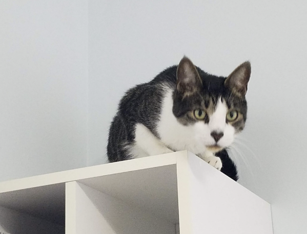

# example-5

make an online change

# Title

## Subtitle

### Sub-subtitle

Ordinary text

_italics_
**bold**

## This is a _challenging_ course but I **love** it.

---

two more lines:

---

---

Use the `cd ..` command to go up one directory.

```
# This is a sample python program
print("Hello world!")
```

> "To boldly go...."

[the bird directory](bird)
[cat](cat)
[dog](dog)


